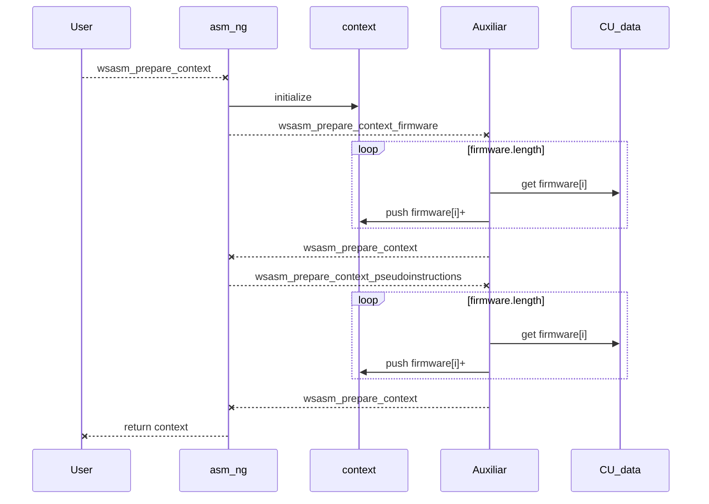
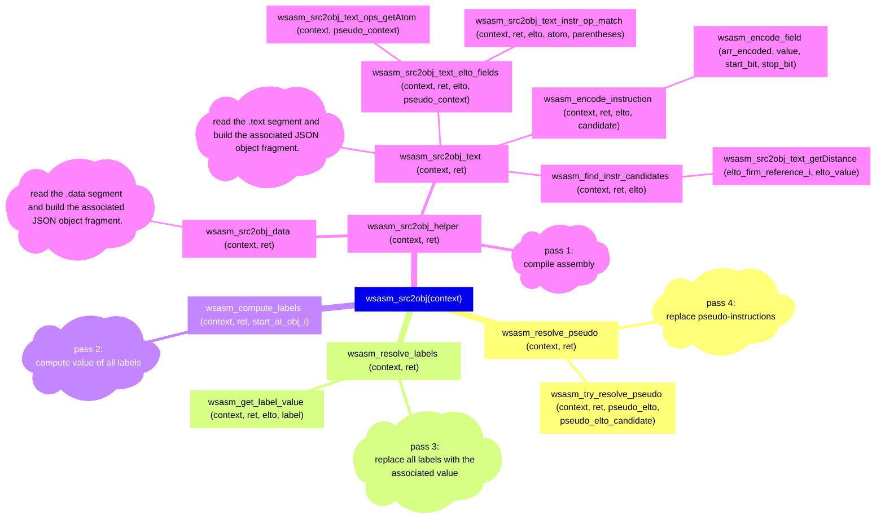
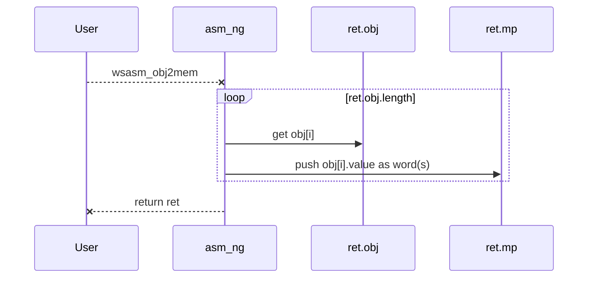

# WepSIM Assembler NG (Next-Generation)

## Table of contents

1. [Public API](#asmng-done)
2. Internal architecture:
   1. [Prepare to compile](#asmng-prepare0)
   2. [Compile to JSON object](#asmng-src2obj)
   3. [Load JSON object in memory](#asmng-obj2bin)
   4. [Elements in the JSON object](#asmng-eltoinobj)
4. [Current state](#asmng-todo)


<a name="asmng-done"/>

## 1) Public API

+ **wsasm_prepare_context(CU_data, options) -> context**
   * It prepare context from firmware (CU_data) plus the default configuration (options), and it builds the context object to be used in the next steps
   * Arguments:
     * CU_data: control unit information from firmware.
     * options: current available option(s) is/are:
       * ```options.instruction_comma = true;``` => add ',' after instructions fields but last (e.g.: li x0 1 -> li x0, 1)
   * Returns:
     * ```context``` to be used in other functions of the public API.
     * If any error happens, return the error at ```context.error```
   * Example:
     ```javascript
      var CU_data= get_simware() ;
      var options = {} ;
      context = wsasm_prepare_context(CU_data, options) ;
      if (context.error != null) {
          return context;
      }
      ...
      ```

+ **wsasm_prepare_source(context, asm_source) -> context**
   * It prepare context with the source code (asm_source) for the next steps
   * Arguments:
     * context: context returned on wsasm_prepare_context(...).
     * asm_source: assembly code to be used.
   * Returns:
     * ```context``` to be used in other functions of the public API updated with source code.
     * If any error happens, return the error at ```context.error```
   * Example:
     ```javascript
     ...
      context = wsasm_prepare_source(context, asm_source) ;
      if (context.error != null) {
          return context;
      }
     ...
     ```

+ **wsasm_src2obj(context) -> ret_obj**
   * Assembler API function to transform from source to JSON object
   * Arguments:
     * context: context returned on wsasm_prepare_source(...).
   * Returns:
     * ```ret_obj``` to be used in other functions of the public API.
     * If any error happens, return the error at ```ret_obj.error```
   * Example:
     ```javascript
     ...
     var ret_obj = wsasm_src2obj(context) ;
     if (ret_obj.error != null) {
         return ret_obj ;
     }
     ...
     ```

+ **wsasm_obj2mem(ret_obj) -> ret_obj**
   * Assembler API to transform from JSON object to main memory content (binary)
   * Arguments:
     * ret_obj: context returned on wsasm_src2obj(...).
   * Returns:
     * ```ret_obj``` to be used in other functions of the public API updated.
     * If any error happens, return the error at ```ret_obj.error```
     * ```ret_obj.mp``` is updated with the binary to be used in main memory.
   * Example:
     ```javascript
     ...
     ret_obj = wsasm_obj2mem(ret_obj) ;
     if (ret_obj.error != null) {
         return ret_obj ;
     }
     ...
     ```

+ **wsasm_src2mem(CU_data, asm_source, options) -> ret**
   * Assembler API to transform from source to main memory content (binary)
     * Equivalent to wsasm_prepare_context(...) + wsasm_prepare_source(...) + wsasm_prepare_options(...) + wsasm_src2obj(...) + wsasm_obj2mem(...)
   * Arguments:
     * CU_data: control unit information from firmware.
     * asm_source: assembly code.
     * options: current available option(s) is/are:
       * ```options.instruction_comma = true;``` => add ',' after instructions fields but last (e.g.: li x0 1 -> li x0, 1)
   * Returns:
     * If any error happens, return the error at ```ret.error```
   * Example:
     ```javascript
      var CU_data= get_simware() ;
      var fasm = inputasm.getValue() ;
      var opts = {} ;
      var ret  = wsasm_src2mem(CU_data, fasm, opts) ;
      if (ret.error != null) {
          return ret;
      }
      ...
     ```

+ **wsasm_src2src(datosCU, text, options) -> ret**
   * Assembler API to transform from source to source (following options)
   * Arguments:
     * datosCU: control unit information from firmware.
     * text: assembly code.
     * options: current available option(s) is/are:
       * ```options.instruction_comma = true;``` => add ',' after instructions fields but last (e.g.: li x0 1 -> li x0, 1)
   * Returns:
     * It returns the source code at ```ret.src_alt```
     * If any error happens, return the error at ```ret.error```
   * Example:
     ```javascript
      var SIMWARE = get_simware() ;
      var fasm = inputasm.getValue() ;
      var opts = { instruction_comma: true } ;
      var ret  = wsasm_src2src(SIMWARE, fasm, opts) ;
      if (ret.error != null) {
          return ret;
      }
      fasm = ret.src_alt ; // normalized syntax
      ...
     ```


## 2) Organization

<a name="asmng-prepare0"/>

### 2.1) Prepare to compile

* Performed by:
    * **context = wsasm_prepare_context (CU_data, options) ;**
    * **context = wsasm_prepare_source (context, asm_source) ;**
 * Description:
   * It prepares the context from firmware (CU_data) and source code (asm_source) and builds the context object to be used in the next steps
  * Auxiliary functions are:
      * **context.options = wsasm_expand_options(options)**: fill the assembler configuration
      * **context = wsasm_prepare_context_firmware(context, CU_data)**: fill firmware
      * **context = wsasm_prepare_context_pseudoinstructions(context, CU_data)**: fill pseudoinstructions





<a name="asmng-src2obj"/>

### 2.2) Compile to JSON object

  * Performed by:
    * **ret = wsasm_src2obj(context) ;**
  * Description:
    * Compile assembly to JSON object
  * Auxiliary functions compile assembly to JSON object in four main steps:
     + [pass 1] **wsasm_src2obj_helper (context, ret)**: read segments and build the initial JSON object
         * **wsasm_src2obj_data (context, ret)**: read the .data segment and build the associated JSON object fragment.
         * **wsasm_src2obj_text (context, ret)**: read the .text segment and build the associated JSON object fragment.
           * wsasm_src2obj_text_elto_fields (context, ret, elto, pseudo_context)
             * wsasm_src2obj_text_instr_op_match (context, ret, elto, atom, parentheses)
             * wsasm_src2obj_text_ops_getAtom (context, pseudo_context)
           * **wsasm_find_instr_candidates (context, ret, elto)**: find in firmware the first definition that matches the read instruction
             * wsasm_src2obj_text_getDistance (elto_firm_reference_i, elto_value)
           * **wsasm_encode_instruction (context, ret, elto, candidate)**: encode in binary (string) an instruction.
             * wsasm_encode_field (arr_encoded, value, start_bit, stop_bit)
     + [pass 2] **wsasm_compute_labels (context, ret, start_at_obj_i)**: compute value of all labels
     + [pass 3] **wsasm_resolve_labels (context, ret, start_at_obj_i)**: check and replace all used labels
         * wsasm_resolve_labels_elto ( context, ret, elto )
         * wsasm_get_label_value (context, ret, elto, label)
     + [pass 4] **wsasm_resolve_pseudo (context, ret)**: replace pseudo-instructions
         * wsasm_try_resolve_pseudo ( context, ret, pseudo_elto, pseudo_elto_candidate )





<a name="asmng-obj2bin"/>

### 2.3) Load JSON object in memory

* Performed by:
   * **wsasm_obj2mem ( ret )**
 * Description:
   * Load JSON object into main memory
   * Auxiliary functions are:
      * wsasm_writememory_if_word                    ( mp, gen, track_source, track_comments )
      * wsasm_writememory_and_accumulate             ( mp, gen, valuebin )
      * wsasm_writememory_and_accumulate_part        ( mp, gen, valuebin, track_source_j, track_source, track_comments )
      * wsasm_writememory_and_accumulate_part_endian ( ret_mp, gen, obj_i, valuebin, n_bytes, j_byte )
      * wsasm_zeropadding_and_writememory            ( mp, gen )




<a name="asmng-eltoinobj"/>

### 2.4) Elements in the JSON object

+ Each element from the JSON object array or **elto** represents any element from the assembly source code (.word, one ascii char from .ascii, one instruction, etc.).
  * For example, from the source code:
    ```
     l1:
     l2:  .word 0x2,
                0x4
     l3:  .byte 1
                2
    ```
  * We have the following elements:
    ```
    [
      { "l1,l2", ".word", 4, 0x2, ... }, // elto
      { ""     , ".word", 4, 0x4, ... }, // elto
      { "l3",    ".byte", 1, 0x1, ... }, // elto
      { "",      ".byte", 1, 0x2, ... }  // elto
    ]
    ```

 + Special attributes are:
      * **elto.byte_size**: number of bytes (integer)
      * **elto.value**: value in binary (string)

  + Special functions are:
     * **wsasm_new_objElto(base_elto)**
       * builds a new empty object (when base_elto is null).


<a name="asmng-todo"/>

## 3) Current State (07/2024)

The initial version is ready.

The future works includes:
 1. More test for the assembler API functions
 2. Review the .align algorithm:
    * supported: https://stackoverflow.com/questions/19608845/understanding-assembly-mips-align-and-memory-addressing
    * pending: try to find if other alternatives might be available.
 3. Review the algorithm to find the instruction/pseudoinstruction that better fits the values, and dependencies:
    * supported: pseudo-instructions of instructions<br>
      pending: reviewing pseudo inside pseudo definition
    * supported: multiple instructions or multiple pseudo-instructions<br>
      pending: reviewing mixing of instructions and pseudo-instructions

