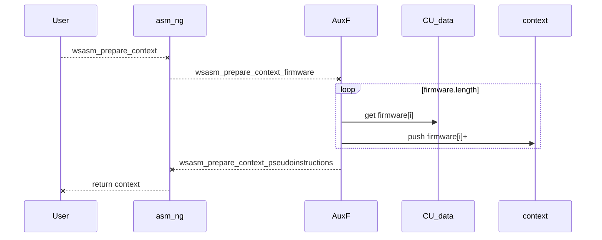
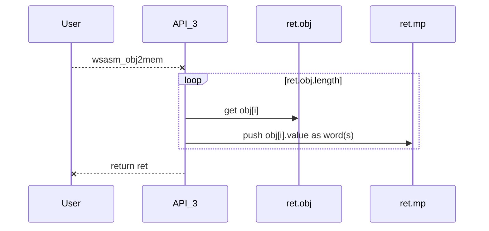

# asm-ng: WepSIM Assembler (Next-Generation)

## Table of contents

- [Public API](#asmng-done)
- [Current state](#asmng-todo)
- Internal architecture:
  - [Prepare to compile](#asmng-prepare0)
  - [Compile to JSON object](#asmng-src2obj)
  - [Load JSON object in memory](#asmng-obj2bin)
  - [Elements in the JSON object](#asmng-eltoinobj)


<a name="asmng-done"/>

## 1) Public API

+ **wsasm_prepare_context(CU_data, options) -> context**
   * It prepare context from firmware (CU_data) plus the default configuration (options), and it builds the context object to be used in the next steps

+ **wsasm_prepare_source(context, asm_source) -> context**
   * It prepare context with the source code (asm_source) for the next steps

+ **wsasm_src2obj(context) -> ret**
   * Assembler API function to transform from source to JSON object

+ **wsasm_obj2mem(ret) -> ret**
   * Assembler API to transform from JSON object to main memory content (binary)

+ **wsasm_src2mem(datosCU, asm_source, options) -> ret**
   * Assembler API to transform from source to main memory content (binary)
   * Equivalent to wsasm_prepare_context + wsasm_prepare_source + wsasm_prepare_options + wsasm_src2obj + wsasm_obj2mem

+ **wsasm_src2src(datosCU, text, options) -> ret**
   * Assembler API to transform from source to source (following options)
   * The current available option(s) is/are:
     * options.instruction_comma = true => add ',' between instructions fields (e.g.: li x0 1 -> li x0, 1)
   * It returns the source code at ret.src_alt


<a name="asmng-todo"/>

## 2) Current State

The TODO list includes:

 1. Check that asm_ng works like asm_v2
 2. Review existing algorithms:
    * The algorithm to find the instruction/pseudoinstruction that better fits the values.
    * The algorithm for .align follows (and it is OK):
      https://stackoverflow.com/questions/19608845/understanding-assembly-mips-align-and-memory-addressing


## 3) Organization

<a name="asmng-prepare0"/>

### A) Prepare to compile

* Performed by:
    **wsasm_prepare_context(CU_data, asm_source)**
 * Description:
   * It prepares the context from firmware (CU_data) and source code (asm_source) and builds the context object to be used in the next steps
  * Auxiliary functions are:
      * wsasm_prepare_context_firmware           ( context, CU_data )
      * wsasm_prepare_context_pseudoinstructions ( context, CU_data )



<a name="asmng-src2obj"/>

### B) Compile to JSON object

  * Performed by:
     **wsasm_src2obj ( context )**
  * Description:
    * Compile assembly to JSON object
  * Auxiliary functions are:
       * wsasm_src2obj_helper ( context, ret )
          * wsasm_src2obj_data ( context, ret )
          * wsasm_src2obj_text ( context, ret )
            ...
       * wsasm_resolve_pseudo ( context, ret )
       * wsasm_resolve_labels ( context, ret )
        * wsasm_compute_labels  ( context, ret, start_at_obj_i )
        * wsasm_get_label_value ( context, ret, elto, label )

  + Compile assembly to JSON object in three main steps:
     + pass 1: compile assembly
       * **wsasm_compile_src2obj(context, ret)**: read several .data/.kdata/.text/... segments and build the JSON object.
         * **wsasm_src2obj_data(context, ret)**: read the .data segment and build the associated JSON object fragment.
         * **wsasm_src2obj_text(context, ret)**: read the .text segment and build the associated JSON object fragment.
           * wsasm_src2obj_text_elto_fields  ( context, ret, elto, pseudo_context )
             * **wsasm_src2obj_text_instr_op_match (context, ret, elto)**: read instructions' fields
             * wsasm_src2obj_text_ops_getAtom ( context, pseudo_context )
           * wsasm_find_candidate_and_encode ( context, ret, elto )
             * **wsasm_encode_instruction(context, ret, elto, candidate)**: encode in binary (string) an instruction.
               * wsasm_encode_field ( arr_encoded, value, start_bit, stop_bit )
               * **wsasm_find_instr_candidates(context, ret, elto)**: find in firmware the first definition that matches the read instruction
                 * wsasm_src2obj_text_getDistance ( elto_firm_reference_i, elto_value )
     + pass 2: replace pseudo-instructions
       * **wsasm_resolve_pseudo(context, ret)**: replace pseudo-instructions
     + pass 3: check that all used labels are defined in the text
       * **wsasm_resolve_labels(context, ret)**: check that all used labels are defined in the text


<a name="asmng-obj2bin"/>

### C) Load JSON object in memory

* Performed by:
    **wsasm_obj2mem ( ret )**
 * Description:
   * Load JSON object into main memory
  * Auxiliary functions are:
      * wsasm_writememory_if_word                    ( mp, gen, track_source, track_comments )
      * wsasm_writememory_and_accumulate             ( mp, gen, valuebin )
      * wsasm_writememory_and_accumulate_part        ( mp, gen, valuebin, track_source_j, track_source, track_comments )
      * wsasm_zeropadding_and_writememory            ( mp, gen )



<a name="asmng-eltoinobj"/>

### D) Elements in the JSON object

+ Each element from the JSON object array or **elto** represents any element from the assembly source code (.word, one ascii char from .ascii, one instruction, etc.).
  * For example, from the source code:
    ```
     l1:
     l2:  .word 0x2,
                0x4
     l3:  .byte 1
                2
    ```
  * We have the following elements:
    ```
    [
      { "l1,l2", ".word", 4, 0x2, ... }, // elto
      { ""     , ".word", 4, 0x4, ... }, // elto
      { "l3",    ".byte", 1, 0x1, ... }, // elto
      { "",      ".byte", 1, 0x2, ... }  // elto
    ]
    ```

 + Special attributes are:
      * **elto.byte_size**: number of bytes (integer)
      * **elto.value**: value in binary (string)

  + Special functions are:
     * **wsasm_new_objElto(base_elto)**
       * builds a new empty object (when base_elto is null).


