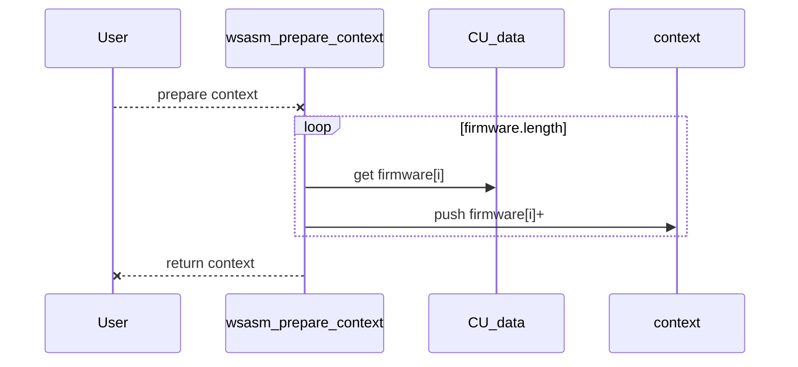
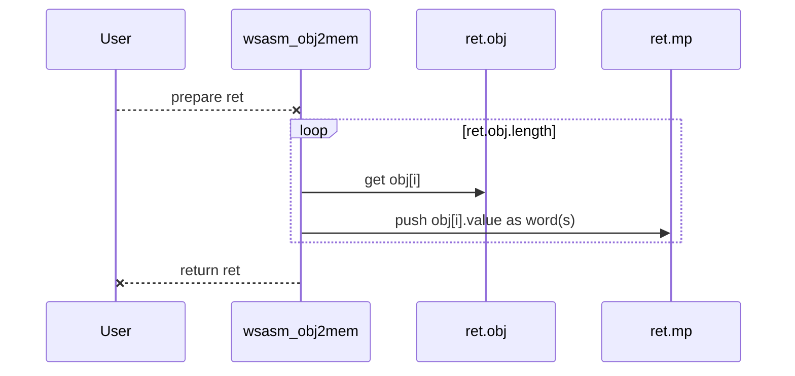

# asm-ng: WepSIM Assembler (Next-Generation)

## Table of contents

- Current State:
  - [TODO: known issues](#asmng-todo)
  - [DONE: now testing](#asmng-done)
- Organization:
  - [Prepare to compile](#asmng-prepare0)
  - [Compile to JSON object](#asmng-src2obj)
  - [Load JSON object in memory](#asmng-obj2bin)


## 1) Current State

<a name="asmng-todo"/>

### A) Pending tasks (TODO list)

+ [1] If there are several 'candidates' instruction, then select the best fit
  * Example:
    ```
    li $1 0x123   <- instruction register inm
    li $1 lab1    <- instruction register address
    ```

+ [2] Review all pending labels (back and forth referenced)
  * Example:
    ```
    loop1: beq $t0 $t1 end1
           ...
           b loop1
     end1: ...
    ```
+ [3] Replace pseudoinstruction with the associated instructions(s).
  * Example:
    ```
    li reg 0x12345678 <- lui reg 0x1234
                      <- add reg reg 0x5678
    ```

<a name="asmng-done"/>

### B) DONE and now testing

+ **wsasm_prepare_context(CU_data, asm_source)**
   Prepare context from firmware (CU_data) and source code (asm_source) build the context object to be used in next steps

+ **wsasm_src2obj(CU_data, asm_source)**
   Assembler-NG API function to transform from source to JSON object
   * .data section
   * .text section
       * pseudo-instruction: no supported right now
       * multiple definition instructions: not supported right now
+ **wsasm_obj2mem(ret)**
   Assembler-NG API to transform from JSON object to main memory content (binary)
  * .data section
     * .word/.ascii/.asciiz/.space supported
  * .text section
     * multiple-word instruction supported


## 2) Organization

<a name="asmng-prepare0"/>

### A) Prepare to compile

+ **wsasm_prepare_context(CU_data, asm_source)**
   Prepare context from firmware (CU_data) and source code (asm_source) build the context object to be used in next steps



<a name="asmng-src2obj"/>

### B) Compile to JSON object

+ **wsasm_src2obj(CU_data, asm_source)**
   Compile assembly to JSON object in three main steps:
    + pass 1: compile assembly (PENDING ~10%)
      * **wsasm_compile_src2obj(context, ret)**: read several .data/.kdata/.text/... segments and build the JSON object.
        * **wsasm_src2obj_data(context, ret)**: read the .data segment and build the associated JSON object fragment.
        * **wsasm_src2obj_text(context, ret)**: read the .text segment and build the associated JSON object fragment.
          * **wsasm_src2obj_text_instr_op(context, ret, elto)**: read instructions' fields
          * **wsasm_src2obj_text_candidates(context, ret, elto)**: find in firmware the first definition that match the read instruction
          * **wsasm_encode_instruction(context, ret, elto)**: encode in binary (string) an instruction.
    + pass 2: replace pseudo-instructions (PENDING ~100%)
      * **wsasm_resolve_pseudo(context, ret)**: replace pseudo-instructions
    + pass 3: check that all used labels are defined in the text (PENDING ~50%)
      * **wsasm_resolve_labels(context, ret)**: check that all used labels are defined in the text

+ Each elemento from the JSON object array or **elto** represents any element from the assembly source code (.word, one ascii char from .ascii, one instruction, etc.).
  * For example, from the source code:
    ```
     l1:
     l2:  .word 0x2,
                0x4
     l3:  .byte 1
                2
    ```
  * We have the following elements:
    ```
    [
      { "l1,l2", ".word", 4, 0x2, ... }, // elto
      { ""     , ".word", 4, 0x4, ... }, // elto
      { "l3",    ".byte", 1, 0x1, ... }, // elto
      { "",      ".byte", 1, 0x2, ... }  // elto
    ]
    ```

  * Special attributes:
      * **elto.byte_size**: number of bytes (integer)
      * **elto.value**: value in binary (string)

  * Special functions:
    * **wsasm_new_objElto(base_elto)**
     builds a new empty object (when base_elto is null).


<a name="asmng-obj2bin"/>

### C) Load JSON object in memory

+ **wsasm_obj2mem(ret)**
   Load JSON object into main memory



